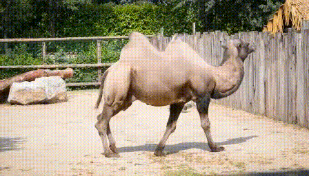

<div align="center", style="text-align: center">
<h1 style="text-align: center">
VASE: Object-Centric Appearance and Shape Manipulation of Real Videos
</h1>

[](https://arxiv.org/abs/2401.02473)
[](https://helia95.github.io/vase-website/)

> [Elia Peruzzo](https://helia95.github.io/), [Vidit Goel](https://vidit98.github.io/), [Deja Xu](https://ir1d.github.io/), [Xingqian Xu](https://xingqian2018.github.io/), [Yifan Jiang](https://yifanjiang19.github.io/), [Zhangyang Wang](https://vita-group.github.io/), [Humphrey Shi](https://www.humphreyshi.com/), [Nicu Sebe](https://disi.unitn.it/~sebe/)

</div>

> **Abstract:** Recently, several works tackled the video editing task fostered by the success of large-scale text-to-image generative models. However, most of these methods holistically edit the frame using the text, exploiting the prior given by foundation diffusion models and focusing on improving the temporal consistency across frames. In this work, we introduce a framework that is object-centric and is designed to control both the object's appearance and, notably, to execute precise and explicit structural modifications on the object.
> We build our framework on a pre-trained image-conditioned diffusion model, integrate layers to handle the temporal dimension, and propose training strategies and architectural modifications to enable shape control. We evaluate our method on the image-driven video editing task showing similar performance to the state-of-the-art, and showcasing novel shape-editing capabilities.

<div align="center", style="text-align: center">
    
</div>

## Updates

- [ ] :computer: Code (coming soon).
- [x] :page_facing_up: Paper released on [arXiv](https://arxiv.org/abs/2401.02473).

## Citation
```latex
@misc{peruzzo2024vase,
      title={VASE: Object-Centric Appearance and Shape Manipulation of Real Videos}, 
      author={Elia Peruzzo and Vidit Goel and Dejia Xu and Xingqian Xu and Yifan Jiang and Zhangyang Wang and Humphrey Shi and Nicu Sebe},
      year={2024},
      eprint={2401.02473},
      archivePrefix={arXiv},
      primaryClass={cs.CV}
}
```